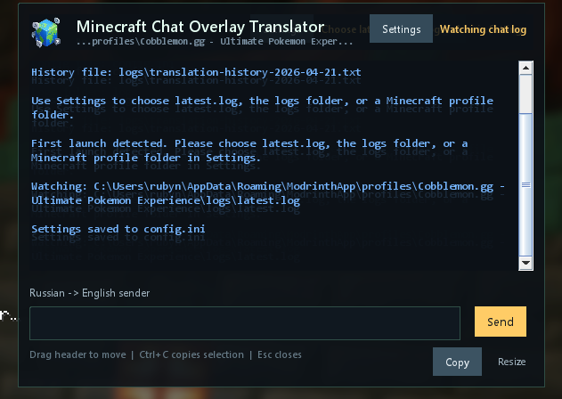
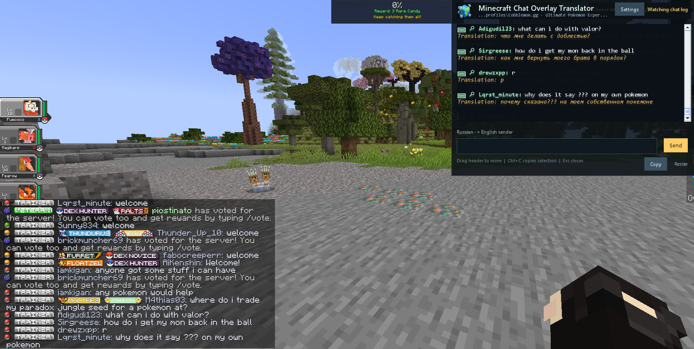
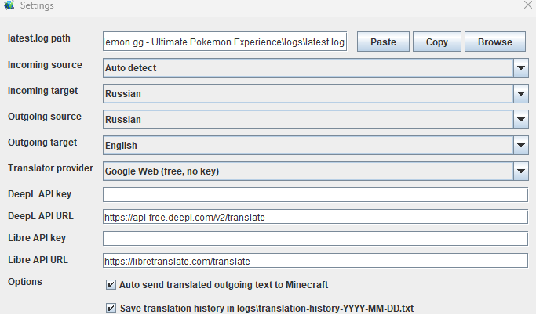

# Minecraft Chat Overlay Translator 🌍💬

> ⚠️ **IMPORTANT: THIS IS NOT A MOD!**
> This application does not inject into or modify the game code in any way. It only reads log files externally. **You cannot get banned** for using this on any server (including Hypixel, etc.).
> 
> ⚠️ **ВАЖНО: ЭТО НЕ МОД!**
> Это приложение никак не внедряется в код игры и не изменяет его. Оно лишь читает текстовые файлы логов извне. **Вы не можете получить бан** за его использование ни на одном сервере.

<p align="center"></p>

### 🛠 Why this tool? | Зачем нужна эта программа?

This app is a perfect replacement for the "Chat Translator" mod on modded servers like **Cobblemon.gg**, **Roanoke**, **RLCraft Official Servers**, or any others with a strict whitelist. Unlike mods, this tool won't cause a "Mismatched mod list" error because it runs as a separate process.

Эта программа — идеальная замена моду "Chat Translator" на серверах с модами, таких как **Cobblemon.gg**, **Roanoke**, **RLCraft** и других с жестким списком модов. В отличие от модов, эта утилита не вызовет ошибку "Mismatched mod list", так как работает отдельным процессом.

---

### ✨ What's New | Что нового (v1.1.0)

- **Smart Chat Filtering:** Now translates only player messages. No more system trash or console clutter.

  *(Умная фильтрация: теперь переводится только чат игроков, без системного мусора).*
- **Rank & Format Support:** Perfectly handles formats like `Nick: Message`, `<Nick> Message`, or `[Rank] Nick » Message`.

  *(Поддержка рангов: корректно распознает ники с донатом и различные форматы сообщений).*
- **Slang Dictionary:** Added `slang-shortcuts.txt` to help the AI understand gaming slang (idk, brb, мб, го).

  *(Словарь сленга: добавлен файл для понимания игровых сокращений).*
- **Emoji Protection:** Symbols like `:D`, `<3` no longer break the translation logic.

  *(Защита смайликов: :D и другие символы больше не ломают перевод).*

---

### 📝 Description | Описание

Desktop overlay translator for Minecraft chat, built with Kotlin/JVM and Swing.

**Десктопный оверлей-переводчик для чата Minecraft, созданный на Kotlin/JVM и Swing.**

It provides mechanical (machine) translation of `latest.log` in real time. It extracts `[CHAT]` lines, translates the message body, and shows the text in a floating always-on-top overlay. 

**Программа осуществляет механический перевод файла `latest.log` в реальном времени. Она извлекает строки `[CHAT]`, переводит текст сообщения и показывает его в плавающем оверлее.**

🔥 **Automatic Chat Typing / Автоматический ввод в чат:** The app supports outgoing translation! You can type in your native language directly into the overlay, and the program will automatically translate and type it directly into the Minecraft chat.

**Приложение поддерживает исходящий перевод! Вы можете писать на своем языке прямо в оверлей, а программа автоматически отправит перевод в чат игры.**

---

### 🎮 Compatibility & Limits | Совместимость и ограничения

**Works with versions 1.7.2 to the latest current version.**
**Работает со всеми версиями, начиная с 1.7.2 и до текущей актуальной.**

⚠️ **Important Note:** Since the app reads the standard `latest.log`, it might work partially or incorrectly with:
- Custom Action Bars (text above health)
- GUI-only menus
- Hover-only text
- Non-standard system spam that doesn't use the `[CHAT]` tag

**Важное примечание:** Так как программа читает стандартный лог, она может работать неполно или криво с Action Bar (текст над ХП), GUI-меню и текстом, который виден только при наведении.

<p align="center"></p>

## 🌐 Supported Languages | Поддерживаемые языки

* English (Английский), Russian (Русский), Ukrainian (Украинский)
* French (Французский), German (Немецкий), Polish (Польский)
* Spanish (Испанский), Japanese (Японский), Portuguese (Португальский), Turkish (Турецкий)

<p align="center"></p>

## 🚀 Highlights | Ключевые особенности

- **Always-on-top borderless Swing overlay**
- **Dark translucent UI with drag and resize support**
- **Pluggable translation providers** (Google Web, DeepL API, LibreTranslate)
- **Customizable slang in `slang-shortcuts.txt`**

## 📦 How to Start | Как запустить

1. Look for **`start-translator.bat`** in the root folder.
2. The app will create **`config.ini`** and open Settings.
3. Choose the path to `latest.log` and select your languages.

## 🛠️ Build from Source | Сборка

```powershell
.\gradlew.bat build installDist
